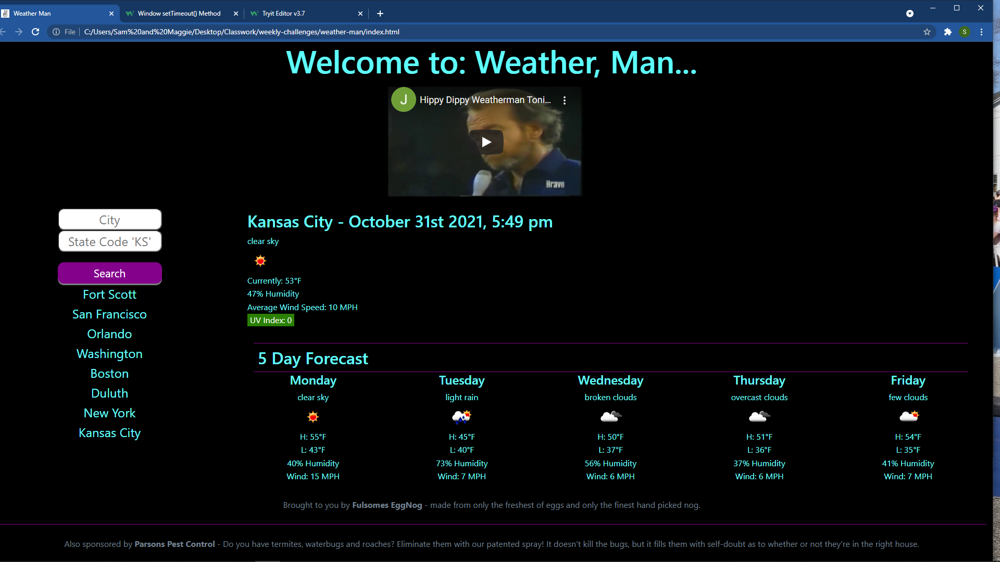

# weather-man
Weather Dashboard challenge, built from scratch, using fetch API to request data from a third party server

## Motivation, What I Did, and What I learned
This was fun! I was able to figure almost all of the problems out on my own. I got a little help from a tutor with the localStorage. I feel like I learned much during this challenge. And, I'm starting to feel confident in how much I have learned so far in the bootcamp. I was excited to write a function that filled in the data for each day of the 5 day forecast. Some of the issues came very easy, and others required some time researching, thinking and failing multiple times before finally succeeding. Overall, I am extremely happy with this project. 

## Links
Below you will find a link to the deployed application and a screenshot.

https://steadysamwise4.github.io/weather-man

